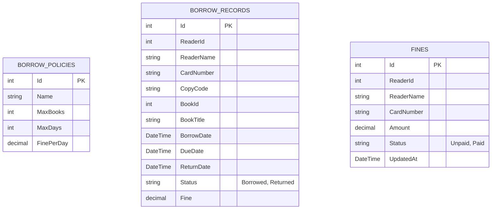

# Digital Library - Circulation Service Backend

Backend nhóm 2 cho đề tài **Hệ thống quản lý thư viện số**. Project được tạo mới theo database ER Diagram tối giản:



> Ghi chú: `ReturnDate` trong SQL và model là nullable (`DateTime?`) vì phiếu đang mượn chưa có ngày trả.

## Công nghệ

- ASP.NET Core 8 Web API
- Entity Framework Core 8
- SQL Server 2022
- Swagger / OpenAPI
- Docker Compose

## Chạy bằng Docker

Tại thư mục chứa `docker-compose.yml`, chạy:

```bash
docker compose up --build
```

Mở Swagger:

```text
http://localhost:5082/swagger
```

Health check:

```text
http://localhost:5082/api/health
```

## Lệnh reset database sạch

Project này dùng volume mới:

```text
circulation_db_data_erdiagram
```

Nếu cần xóa database để tạo lại từ đầu:

```bash
docker compose down -v --remove-orphans
docker compose up --build
```

Nếu volume bị kẹt:

```bash
docker ps -a --filter volume=circulation_db_data_erdiagram
docker rm -f <CONTAINER_ID>
docker volume rm circulation_db_data_erdiagram
```

## API chính

| Method | Endpoint | Mục đích |
|---|---|---|
| GET | `/api/borrow-policies` | Danh sách chính sách mượn |
| GET | `/api/borrow-policies/current` | Chính sách mới nhất đang áp dụng |
| POST | `/api/borrow-policies` | Tạo chính sách mượn |
| PUT | `/api/borrow-policies/{id}` | Cập nhật chính sách |
| DELETE | `/api/borrow-policies/{id}` | Xóa chính sách |
| GET | `/api/borrow-records` | Danh sách phiếu mượn/trả |
| GET | `/api/borrow-records/overdue` | Danh sách phiếu quá hạn |
| GET | `/api/borrow-records/reader/{readerId}` | Lịch sử mượn của độc giả |
| POST | `/api/borrow-records` | Tạo phiếu mượn |
| POST | `/api/borrow-records/{id}/return` | Trả sách và tính phạt |
| GET | `/api/fines` | Danh sách phí phạt/công nợ |
| GET | `/api/fines/reader/{readerId}` | Phí phạt theo độc giả |
| GET | `/api/fines/reader/{readerId}/debt` | Tổng công nợ chưa thanh toán |
| POST | `/api/fines/{id}/pay` | Thanh toán phí phạt |

## Luồng demo nhanh

1. Mở `/swagger`.
2. Gọi `GET /api/borrow-policies/current` để xem chính sách mặc định.
3. Gọi `POST /api/borrow-records` để tạo phiếu mượn.
4. Gọi `GET /api/borrow-records` để xem danh sách mượn.
5. Gọi `POST /api/borrow-records/{id}/return` để trả sách.
6. Nếu quá hạn, kiểm tra `GET /api/fines`.
7. Gọi `POST /api/fines/{id}/pay` để thanh toán phí phạt.

## Chạy local không Docker

Cần có SQL Server đang chạy ở port `14333` hoặc sửa connection string trong `CirculationService.Api/appsettings.json`.

```bash
cd CirculationService.Api
dotnet restore
dotnet run
```

## Cấu hình xác thực

Mặc định demo tắt xác thực:

```json
"Auth": {
  "DisableAuth": true
}
```

Khi ghép với Identity Service, đổi thành `false` và dùng JWT secret/issuer/audience chung với hệ thống.
