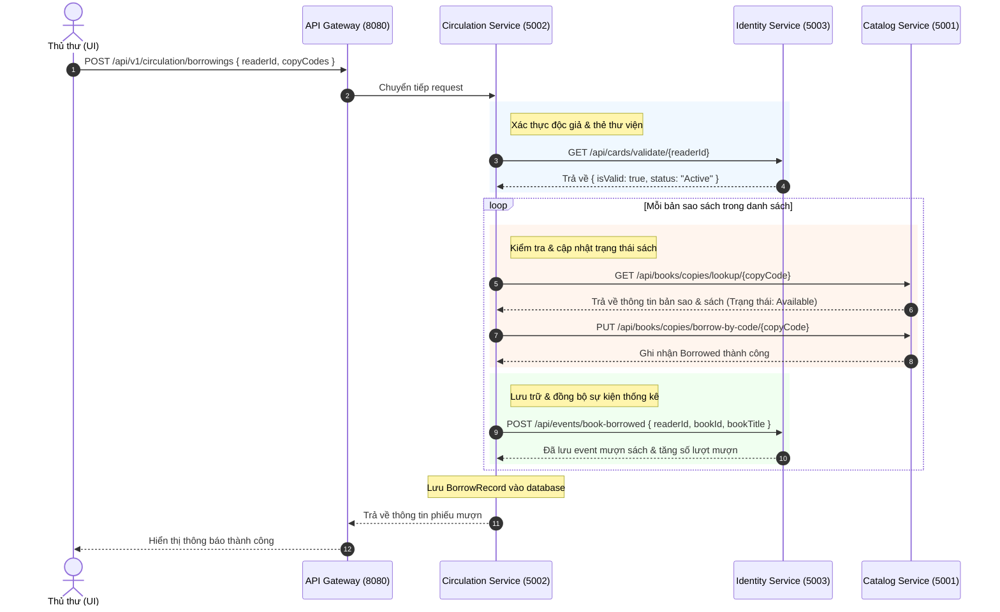
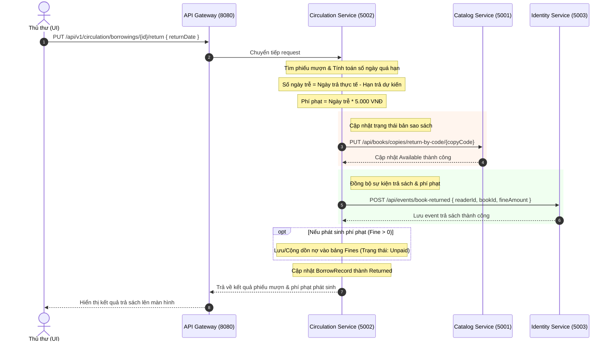

# Luồng Nghiệp vụ Hệ thống (API Flow)

Tài liệu này mô tả chi tiết các bước tương tác giữa các service khi xảy ra nghiệp vụ chính: **Mượn sách** và **Trả sách**.

---

## 1. Quy trình Mượn sách (Borrow Flow)

Khi thủ thư thực hiện thao tác cho mượn sách trên giao diện:

---

## 2. Quy trình Trả sách (Return Flow)

Khi độc giả đem trả sách tại quầy thư viện:

