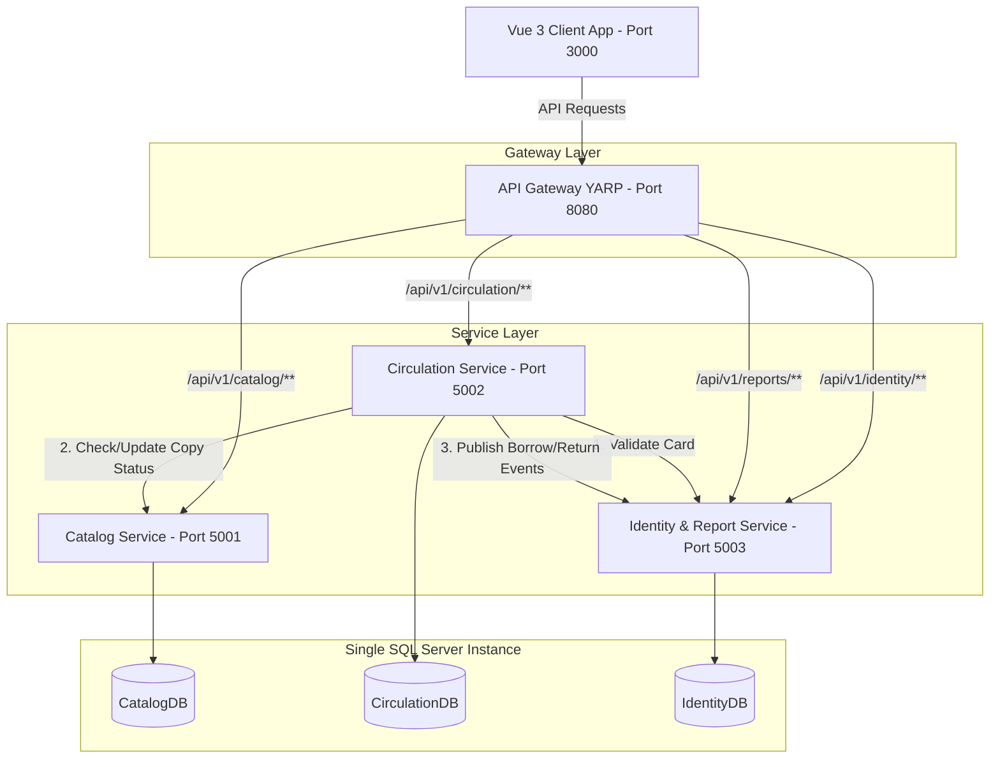

# Kiến trúc Hệ thống DigiLib (Digital Library System)

Dự án DigiLib được thiết kế theo kiến trúc **Microservices** phân tán, sử dụng các công nghệ hiện đại nhằm đảm bảo khả năng mở rộng, tính độc lập của dịch vụ và đồng nhất trong thiết kế cơ sở dữ liệu.

## Sơ đồ Tổng quan Kiến trúc

---

## Chi tiết các Thành phần

### 1. Frontend Client (`frontend/`)
* **Công nghệ**: Vue 3 (Vite), Vuetify 3, Pinia (State Management), Vue Router.
* **Chức năng**: Giao diện duy nhất cho Admin, Librarian (Thủ thư) và Reader (Độc giả). Hỗ trợ xem sách, quản lý sách, bản sao sách, độc giả, thực hiện mượn/trả sách, xem báo cáo thống kê, cấu hình hệ thống.
* **Triển khai**: Build tĩnh qua Nginx, chạy ở cổng `3000`.

### 2. API Gateway (`api-gateway/`)
* **Công nghệ**: ASP.NET Core 8, YARP (Yet Another Reverse Proxy).
* **Chức năng**:
  * Là điểm đầu vào duy nhất cho mọi request từ Frontend.
  * Điều tuyến (Reverse Proxy) request đến các service backend phù hợp dựa theo path prefix (`/api/v1/...`).
  * Xử lý CORS tập trung để bảo vệ hệ thống.
* **Triển khai**: Cổng `8080`.

### 3. Catalog Service (`catalog-service/`)
* **Công nghệ**: ASP.NET Core 8 Web API + EF Core + SQL Server.
* **Chức năng**: Quản lý thông tin sách (Books), Thể loại (Categories), Bản sao sách (BookCopies).
* **Triển khai**: Cổng `5001`.
* **Database**: `CatalogDB` chứa bảng `Books`, `BookCopies`, `Categories`.

### 4. Circulation Service (`circulation-service/`)
* **Công nghệ**: ASP.NET Core 8 Web API + EF Core + SQL Server.
* **Chức năng**: Quản lý quy trình mượn/trả sách, gia hạn thẻ, kiểm tra số lượng mượn giới hạn, tính toán phí phạt quá hạn (5.000đ/ngày) và ghi nhận thanh toán nợ của độc giả.
* **Liên kết**: Giao tiếp HTTP Sync với Identity Service (để validate thẻ độc giả, log event) và Catalog Service (để thay đổi trạng thái bản sao sách).
* **Triển khai**: Cổng `5002`.
* **Database**: `CirculationDB` chứa bảng `BorrowRecords`, `Fines`, `BorrowPolicies`.

### 5. Identity & Report Service (`identity-service/`)
* **Công nghệ**: ASP.NET Core 8 Web API + EF Core + SQL Server + JWT.
* **Chức năng**:
  * Đăng ký, đăng nhập, cấp JWT Token cho người dùng (Role-based: Admin, Librarian, Reader).
  * Quản lý độc giả (Readers) và thẻ thư viện (LibraryCards).
  * Tiếp nhận sự kiện mượn/trả sách gửi về từ Circulation Service để tổng hợp dữ liệu thống kê.
  * Xuất báo cáo hoạt động thư viện (độc giả mượn nhiều nhất, sách hot nhất, doanh thu phạt...).
* **Triển khai**: Cổng `5003`.
* **Database**: `IdentityDB` chứa bảng `Users` (Admin, Thủ thư, Độc giả), `LibraryCards`, `BorrowEvents`, `ReturnEvents`, `BookStatistics`, `ActivityLogs`.
