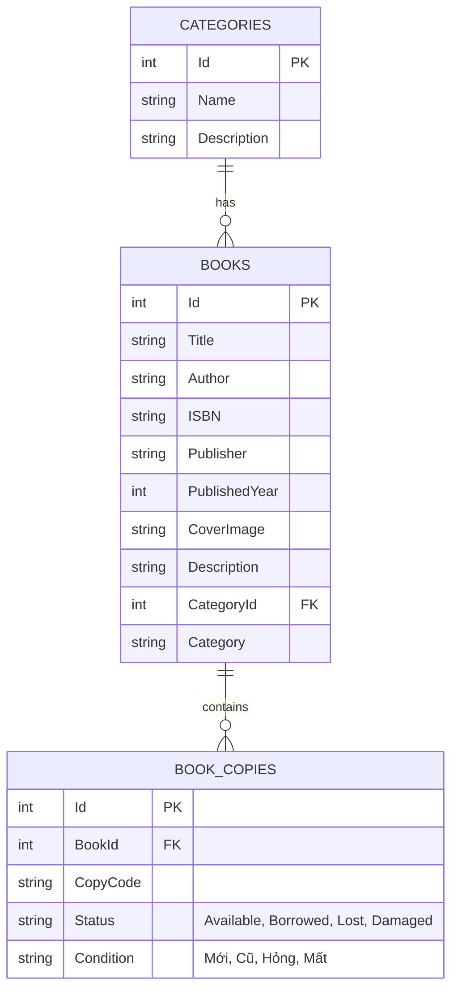
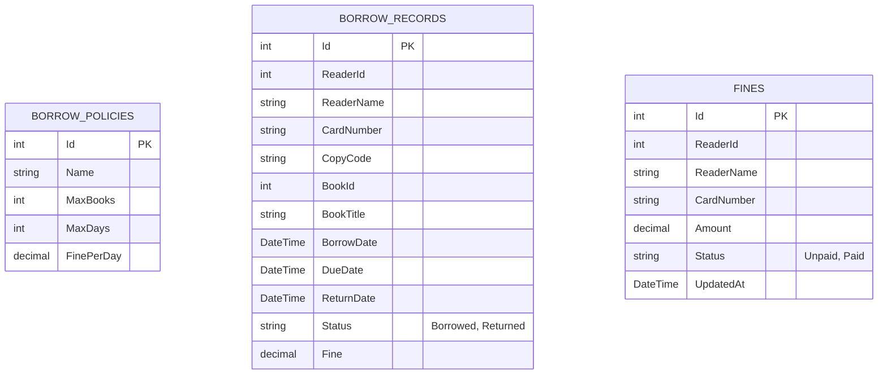
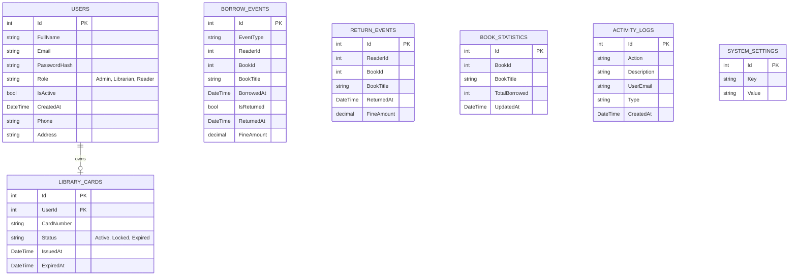

# Thiết kế Cơ sở Dữ liệu DigiLib

Hệ thống sử dụng kiến trúc **Database-per-service** để đảm bảo tính độc lập. Tuy nhiên, để triển khai đơn giản, dễ chạy và dễ quản lý, tất cả 3 database riêng biệt đều được lưu trữ trên **cùng một SQL Server Instance**.

---

## 1. Catalog Database (`CatalogDB`)
Quản lý danh mục sách và tình trạng vật lý của sách.

---

## 2. Circulation Database (`CirculationDB`)
Quản lý thông tin giao dịch mượn/trả và công nợ quá hạn.

---

## 3. Identity Database (`IdentityDB`)
Quản lý người dùng, thẻ thư viện, nhật ký hoạt động và tiếp nhận event tổng hợp báo cáo.

